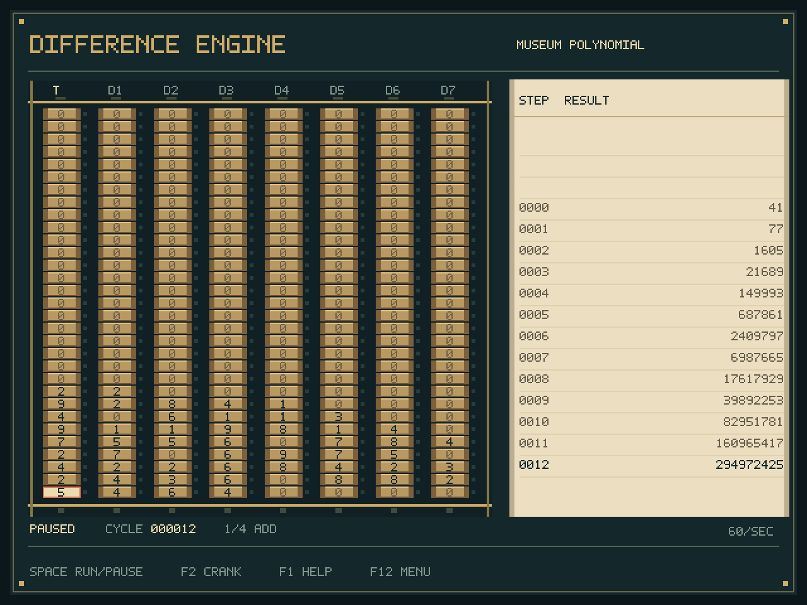

# Babbage's Difference Engine for MiSTer

Calculate with Difference Engine No. 2: eight columns of 31 decimal wheels, seven orders of difference, and a paper roll of results. Watch the carries, turn the crank, or let it run.



## Install

Download [the core](releases/DifferenceEngine_20261005.rbf?raw=true) and copy it to `_Computer/` on your MiSTer. Optionally copy the files in [`programs/`](programs/) to `games/DifferenceEngine/`.

No ROMs or SDRAM module are needed. Launch the core to start with the museum demonstration.

## Controls

| Key | Action |
| --- | --- |
| Space | Run / pause |
| F2 / F3 | Crank one cycle / advance one phase |
| F4 / F5 / F6 | Next demonstration / reload / clear |
| Arrow keys | Select a wheel |
| 0–9 | Set the selected digit |
| Enter / Backspace | Turn the selected wheel up / down |
| Home / End | Select the top / units wheel |
| F1 | Help |
| F12 | MiSTer menu |

Pause before editing wheels. If you stop partway through a cycle, press F2 to finish it first.

The MiSTer menu selects demonstrations, speed, and `.de2` tables. Squares, cubes, triangular numbers, and a carry cascade are included. You can also map a gamepad through MiSTer's usual joystick setup.

Red pins mark pending carries. The paper keeps the last sixteen results; the leftmost column shows all 31 digits. Step counts start at zero when you load a table.

## Things to try

Start with the paper on the right. The newest answer is at the bottom. The full answer is in **T**, the leftmost column of wheels. Ignore the leading zeroes.

### Make a list of squares

1. Press **F12** to open the MiSTer menu.
2. Set **Demonstration** to **Squares**. Choose **Reload demonstration** to start over if Squares was already selected.
3. Set **Result speed** to **1 second**, then press **F12** to close the menu.
4. Press **F2** once. Wait until the panel says **PAUSED** again.
5. Press **F2** a few more times, waiting between presses.

The paper should read:

```text
Step    Result
   0         0
   1         1
   2         4
   3         9
   4        16
   5        25
```

You have made a table of `0 × 0`, `1 × 1`, `2 × 2`, and so on. **Space** lets it run by itself; press Space again to pause. **F5** starts the same example over.

Try **Cubes** next. You should get `0, 1, 8, 27, 64, 125`. **Triangular** gives `0, 1, 3, 6, 10, 15`: the number of dots in triangles with one more row each time.

### Make your own counting machine

Let's start at 10 and add 3 on every turn.

1. Close any menus or help, then press **F6**. This clears the table and paper.
2. Use **Left / Right** until the highlighted wheel is in **T**.
3. Press **End**, then **Up** once. You are now on the tens digit. Type **1**, then **0**. Typing moves the selection down, so this enters **10**.
4. Press **Right** to select **D1**, then **End** to reach its bottom digit. Type **3**.
5. Press **F2**, wait for **PAUSED**, and repeat.

You should get **10, 13, 16, 19, 22…**. T is the starting value; D1 is what gets added each turn. Leave D2 through D7 at zero for a constant increment.

To enter a different number, select its highest nonzero digit and type downwards. For **125**, press End, Up twice, then type 1, 2, 5. Use the number keys to replace a wrong digit. Backspace turns a wheel down by one; it does not delete text.

### See why squares work

Load **Squares** again. **D1** starts at **1**, then becomes **3, 5, 7, 9…** after each complete turn. These are the amounts needed to get from one square to the next:

```text
0 + 1 = 1
1 + 3 = 4
4 + 5 = 9
9 + 7 = 16
```

**D2 stays at 2**, making the next increment two larger each time. The engine gets the squares using addition alone.

You can set this up yourself: clear with F6, leave T at zero, put **1** in D1 and **2** in D2. Leave the other columns at zero. Crank with F2.

### Watch a carry

1. In the menu, choose **Carry cascade**, then **Reload demonstration** if needed. Close the menu.
2. Press **F3** once. The bottom 9 in T becomes 0, and a red pin appears beside it. The carry is waiting.
3. Press **F3** again. The carry travels through the other 9s, leaving T full of zeroes. A lamp below T marks the carry past the top.
4. Press **F2** to finish the turn and print the result.

F3 lets you stop between parts of a turn. F2 finishes a whole turn. Usually F2 is the one you want.

### If you lose your place

- **Nothing moves:** close F1 help or the F12 menu. Both pause the engine. At the slowest speed, a turn takes several seconds.
- **A digit won't change:** pause with Space if the engine is running, then press F2 and wait for PAUSED. You can edit only between complete turns.
- **Wrong number:** select the wrong wheel and type the right digit. Edits restart the cycle count and clear the paper.
- **Start the example again:** F5 reloads the table you started from. After F6, that's a blank table. It does not save your hand edits.
- **Start from nothing:** F6 clears all columns.
- **Lost an old answer:** the paper holds sixteen results. Reload and crank again to reproduce earlier ones.

For a different polynomial, see [making a difference table](docs/tables.md). Load the resulting `.de2` file through **F12 → Load difference table**.

Inspired by the [PDP-1](https://github.com/MiSTer-devel/PDP1_MiSTer), [Altair 8800](https://github.com/MiSTer-devel/Altair8800_Mister), and [EDSAC](https://github.com/MiSTer-devel/EDSAC_MiSTer) cores. [GPL-2.0](LICENSE).
